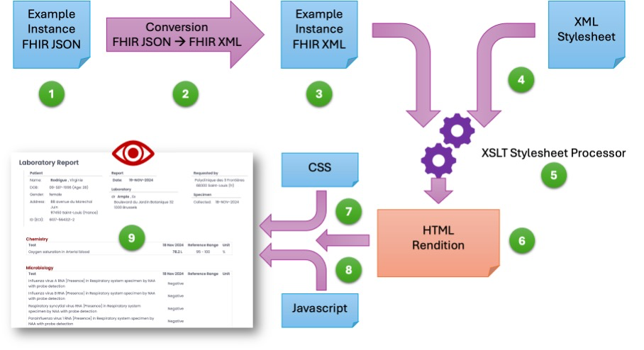

# Principles
**Visualize HL7 Example and Test Instances (vi7eti)**, pronounced /viːˈsɛtiː/

© dr Kai Heitmann, [HL7 Europe](https://hl7europe.org) | [Privacy Policy](https://hl7europe.eu/privacy-policy-for-hl7-europe/) • LGPL-3.0 license

In nascent mode, more to follow...

## Reference Implementation vi7eti

vi7eti is a reference implementation for styleguides, such as the ePI Styleguide, or can just be used to see, what example and test instance could look like for human consumption.

In order to make the visualization as easy as possible, vi7eti uses the following workflow to render XML or JSON example instances. Every of the following steps is executed in realtime in vi7eti, but a pre-processing would also be possible.

If a FHIR JSON Instance is given (1), it is converted through XSLT Stylesheets (2) to FHIR XML (3). For the case the FHIR XML instance is already available it is used. The XML instance (4) is then processed using a XSLT Stylesheet (5) by means of an XSLT Stylesheet processor (6). The HTML rendition contains already references to the helping Cascading Stylesheet CSS (7) and possible Vanilla Javascripts (8) and can directly visualized (9) for human consumption. 
